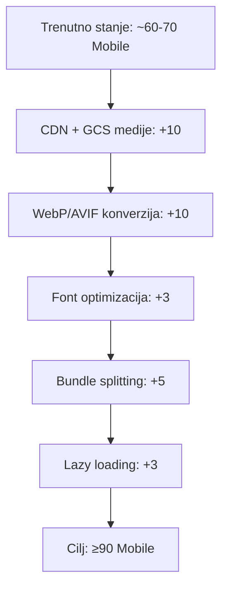
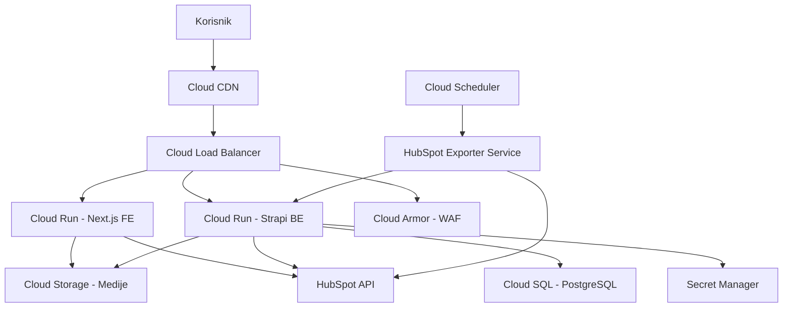

# 🔍 CBS Portal — Arhitektonska Analiza i Preporuke

**Datum:** 13.07.2026.
**Autor:** Sistem Arhitekta (AI)
**Status:** Sveobuhvatni izveštaj

---

## 📋 Sadržaj

1. [Izvršni rezime](#1-izvršni-rezime)
2. [Mapiranje PDF zahteva na trenutno stanje](#2-mapiranje-pdf-zahteva-na-trenutno-stanje)
3. [Bezbednosni propusti (KRITIČNO)](#3-bezbednosni-propusi-kriticno)
4. [SEO optimizacija](#4-seo-optimizacija)
5. [Performance optimizacija](#5-performance-optimizacija)
6. [Kvalitet koda i arhitektura](#6-kvalitet-koda-i-arhitektura)
7. [GCP hosting strategija](#7-gcp-hosting-strategija)
8. [Bagovi i potencijalni problemi](#8-bagovi-i-potencijalni-problemi)
9. [HubSpot integracija](#9-hubspot-integracija)
10. [Prioritetna lista akcija](#10-prioritetna-lista-akcija)

---

## 1. Izvršni rezime

Projekat CBS Portal je **headless CMS** sajt za nekretnine, izgrađen na **Next.js 16 + Strapi 5.48**. Arhitektura je moderna i dobro osmišljena, ali postoje **kritični bezbednosni propusti**, **SEO nedostaci** i **performansni problemi** koji moraju biti rešeni pre produkcijskog launch-a na GCP.

### Ocena po kategorijama:

| Kategorija | Ocena | Status |
|---|---|---|
| Arhitektura | ⭐⭐⭐⭐ | Dobra — headless, i18n, ISR |
| Bezbednost | ⚠️ KRITIČNO | API tokeni u source code-u |
| SEO | ⭐⭐⭐ | Solidna osnova, potrebne dorade |
| Performanse | ⭐⭐ | Bez CDN, bez WebP/AVIF, bez image optimization |
| Kvalitet koda | ⭐⭐⭐ | TypeScript strict OFF, console.log u produkciji |
| GCP spremnost | ⭐⭐ | Plan postoji, implementacija nije kompletna |

---

## 2. Mapiranje PDF zahteva na trenutno stanje

PDF "ZAHTEV ZA IZRADU SAJTA - drugi krug" je **RFP (Request for Proposal)** od 28.05.2026. koji traži ponude za izradu nove veb platforme. Trenutni codebase je implementacija koja odgovara na ove zahteve.

### 2.1 Zahtevi koji su ISPUNJENI ✅

| Zahtev iz PDF-a | Implementacija |
|---|---|
| Headless CMS (Strapi) | `cbs-portal-strapi-be` — Strapi 5.48 |
| Next.js frontend | `cbs-portal-ui` — Next.js 16 App Router |
| Multi-language SR+EN | `[lang]` routing + `sr.json`/`en.json` |
| hreflang implementacija | `seoUtils.ts` — `resolveHreflangPaths()` |
| HubSpot integracija (nekretnine) | `hubspot-cbs-deal-exporter` + `propertyImportService.js` |
| Dnevna sinhronizacija nekretnina | `node-cron` twice-daily sync |
| SEO-friendly URL | Rewrite sistem + `trailingSlash: true` |
| sitemap.xml + robots.txt | Dinamički generisani |
| Schema markup | JSON-LD komponenta (`JsonLd.tsx`) |
| Open Graph + social sharing | `buildMetadata()` u `seoUtils.ts` |
| CMS modularan | Content types: Publication, Property, Service, Team Member, Career, Page |
| Role-based access | Strapi Users & Permissions plugin |
| SSL implementacija | Planirano kroz GCP Load Balancer |
| Watermark branding | CW logo overlay u `propertyImportService.js` |
| Ownership (pun pristup kodu) | Sav kod je u repozitorijumu |
| Modularne landing stranice | Kroz Strapi Page content type |

### 2.2 Zahtevi koji NISU implementirani ❌

| Zahtev iz PDF-a | Nedostaje |
|---|---|
| Google PageSpeed ≥90 Mobile / ≥95 Desktop | Nije verifikovano, verovatno neispunjeno bez CDN |
| LCP < 2.5s, INP < 200ms, CLS < 0.1 | Nije mereno/optimizovano |
| CDN implementacija | **Nedostaje** — planiran GCP CDN, nije konfigurisan |
| WebP/AVIF konverzija | **Nedostaje** — nema auto-konverzije |
| lazy loading video | Nema video sadržaja, ali nije implementirano |
| Google Tag Manager | **Nedostaje** |
| Google Analytics 4 | **Nedostaje** |
| Google Ads conversion tracking | **Nedostaje** |
| Meta Pixel (Facebook/Instagram) | **Nedostaje** |
| Event tracking (CTA klikovi, forme) | **Nedostaje** |
| Remarketing setup | **Nedostaje** |
| Kontakt forme sa validacijom | **Delimično** — HTML forme, bez reCAPTCHA |
| "Request more info" forme | **Nedostaje** |
| Newsletter signup | **Nedostaje** |
| CRM lead forwarding (HubSpot) | **Nedostaje** sa forme |
| Optimizacija JS/CSS/fontova | Fontovi nisu subset-ovani, nema code splitting analize |
| reCAPTCHA na formama | **Nedostaje** |
| Backup sistem | **Nedostaje** — oslanja se na GCP managed |
| Firewall / anti-malware | **Delimično** — GCP Cloud Armor nije konfigurisan |
| Monitoring i alerting | **Nedostaje** |

---

## 3. Bezbednosni propusi (KRITIČNO)

### 🔴 CRITICAL: Hardkodirani API tokeni u source code-u

**Fajl:** `d:\Projects\cbs\update_html.js`
```javascript
const API_TOKEN = '3849d82b1a...'; // CEO TOKEN VIDLJIV U KODU
```

**Fajl:** `d:\Projects\cbs\hubspot-cbs-deal-exporter\.env`
```env
HUBSPOT_ACCESS_TOKEN=pat-eu1-xxxx-xxxx-xxxx-xxxxxxxxxxxx
STRAPI_API_TOKEN=xxxxxxxxxxxxxxxxxxxxxxxxxxxxxxxxxx...
GOOGLE_MAPS_API_KEY=AIzaSyXXXX-xxxxxxxxxxxxxxxxxxxxxxxx
MAPBOX_ACCESS_TOKEN=pk.eyJ1I...
```

**Fajl:** `d:\Projects\cbs\cbs-portal-ui\.env.local`
```env
NEXT_PUBLIC_GOOGLE_MAPS_API_KEY=AIzaSyXXXX-xxxxxxxxxxxxxxxxxxxxxxxx
```

### ⚠️ Akcije:

1. **ODMAH rotirati sve expose-ovane tokene** (HubSpot, Strapi, Google Maps, Mapbox)
2. Obrisati `update_html.js` ili ga prebaciti u `scripts/` sa `.env` fajlom
3. Dodati `.env` i `.env.local` u `.gitignore` (već postoji, ali proveriti da fajlovi nisu commit-ovani)
4. Koristiti **GCP Secret Manager** za sve produkcijske tajne
5. Google Maps API key treba biti restrict-ovan na specifične domene
6. `NEXT_PUBLIC_GOOGLE_MAPS_API_KEY` — ili koristiti serverski proxy za Google Maps pozive, ili prihvatiti da je javni (ali ga restrict-ovati na domen)

### 🟡 WARNING: Drugi bezbednosni propusti

- **`wp-data/mysql.sql-auth.json`** sadrži MySQL password hash — **obrisati iz repoa**
- **`wp-config.php`** u `wp-data/` — WordPress konfiguracija sa DB kredencijalima
- **CORS konfiguracija** — `ALLOWED_ORIGINS` u HubSpot exporteru nije restriktivan
- **Nema rate limiting** na Strapi API endpointima
- **Security headers** — nedostaju: `Content-Security-Policy`, `X-Frame-Options`, `X-Content-Type-Options`
- **`strict: false`** u `tsconfig.json` — TypeScript ne hvata potencijalne `null`/`undefined` bagove

### 🟢 REŠENO (Jul 2026): UAT/Staging Password Gate
- **Implementirana zaštita UAT sajta** password gate-om (`GATE_ENABLED=true`):
  - Svi neautentifikovani zahtevi se preusmeravaju na `/gate` login formu
  - Google/search engine roboti blokirani preko `robots.txt Disallow /` + `X-Robots-Tag: noindex`
  - Kredencijali se čuvaju u GCP Secret Manager-u (`gate-username`, `gate-password`, `gate-secret`)
  - Auth token: HTTP-only, Secure, SameSite=Lax cookie (HMAC-SHA256, 30 dana)
  - **Prekidač**: `GATE_ENABLED=false` → sajt postaje potpuno javan
- Videti: `cbs-portal-ui/docs/confluence_04_deployment_and_operations.md` §4

---

## 4. SEO optimizacija

### 4.1 Šta je DOBRO ✅

- Dinamički `sitemap.xml` sa hreflang alternatama
- `robots.ts` sa pravilnim pravilima
- `trailingSlash: true` — konzistentni URL-ovi
- JSON-LD structured data (`JsonLd.tsx`)
- Open Graph + Twitter Card meta tagovi
- `buildMetadata()` sa fallback lancem za description/image
- `resolveHreflangPaths()` za cross-locale slug bridging
- LegacySlug sistem za stare WP URL-ove
- SEO lifecycle hooks u Strapi-ju (auto-fill MetaTitle, MetaDescription, OGImage)

### 4.2 Šta treba POPRAVITI ⚠️

| Problem | Preporuka |
|---|---|
| `crawlDelay: 10` u `robots.ts` | **Previše agresivno!** Smanjiti na `crawlDelay: 1` ili ukloniti. Google ignoriše crawl-delay, ali Bing/Yandex poštuju — 10 sekundi je previše. ✅ **Rešeno** — smanjeno na `crawlDelay: 1` (Jul 2026). |
| SEO metadata za Team Member | `team-member` content type **nema SEO polja** (ni MetaTitle, ni MetaDescription, ni lifecycles). Dodati ih. |
| Kanonski URL-ovi za filtrirane stranice | Property filter stranice nemaju canonical tag — može dovesti do duplicate content-a |
| Breadcrumbs schema | Dodati `BreadcrumbList` schema markup na sve stranice |
| Slike bez dimenzija | Mnoge slike nemaju eksplicitne `width`/`height` — loše za CLS |
| Alt text optimizacija | Automatski alt text nije implementiran (PDF zahtev 7.5) |
| Internal linking struktura | Nema automated internal linking-a između povezanih sadržaja |
| 404 stranica | `not-found.tsx` postoji, ali ne vraća pravi 404 HTTP status za dinamičke rute? |
| URL struktura — mešani jezici | Folderi su na srpskom (`/nekretnine`, `/o-nama`) — ovo može biti zbunjujuće za SEO. Preporučuje se engleski folder naming ili potpuno dosledan pristup. |
| `robots.ts` — `disallow: ['/api/', '/_next/']` | `/api/` se ionako ne indeksira, ali `/sr/api/` bi tehnički mogao biti dostupan. Proveriti. |

### 4.3 SEO preporuke za GCP

- **Cloud CDN** sa cache policy za statičke resurse
- **GCP Cloud Load Balancer** sa HTTP→HTTPS redirectom
- **Custom domain** sa www→non-www (ili obrnuto) 301 redirectom
- Automatska **WebP/AVIF** konverzija kroz Cloud Functions ili CDN

---

## 5. Performance optimizacija

### 5.1 Kritični nedostaci

| Problem | Uticaj | Rešenje |
|---|---|---|
| **Nema CDN** | LCP > 3s za međunarodne posetioce | GCP Cloud CDN + Cloud Storage za medije |
| **Nema WebP/AVIF** | Slike su 2-5x veće nego potrebno | Automatska konverzija pri upload-u |
| **~2000+ slika u `public/images/`** | Build je spor, nema optimizacije | Prebaciti na GCS bucket |
| **Fontovi nisu optimizovani** | Gotham-Bold.otf + Gotham-Book.otf = ~200KB | Subset-ovati na latin-ext, konvertovati u woff2 |
| **Nema image lazy loading** van Next.js default | Below-the-fold slike se učitavaju odmah | Explicitni `loading="lazy"` ili `priority` za LCP slike |
| **Bootstrap import** | Uvozi se ceo grid + utilities, iako je samo grid potreban | Tree-shake ili preći na CSS Grid |
| **Nema bundle analize** | Nepoznato koliko JS-a se šalje klijentu | Dodati `@next/bundle-analyzer` |
| **ISR `revalidate: 60`** | Promene u CMS-u kasne do 60s | Razmotriti On-Demand Revalidation ili webhook |

### 5.2 Preporuke za postizanje PageSpeed ≥90



### 5.3 Specifične akcije

1. **GCS Upload Provider za Strapi** — već dokumentovano u `backend-plugins.md`, samo aktivirati
2. **Image Optimization API** — Next.js `sharp` za automatsku optimizaciju ili `@strapi/provider-upload-google-cloud-storage` + Cloud Functions za WebP konverziju
3. **`next.config.mjs`** — dodati `images.formats = ['image/avif', 'image/webp']`
4. **Font loading strategy** — `next/font/google` ili lokalni font sa `font-display: swap`
5. **CSS optimization** — Bootstrap import je ~200KB. Samo grid + utilities su ~30KB. Proveriti da se ne uvozi ceo Bootstrap CSS.
6. **Streaming/Partial Prerendering** — Next.js 16 podržava PPR za još brže učitavanje

---

## 6. Kvalitet koda i arhitektura

### 6.1 Arhitekturni problemi

| Problem | Objašnjenje | Preporuka |
|---|---|---|
| **`strict: false`** u `tsconfig.json` | TypeScript ne proverava `null`/`undefined`, implicit `any` | Postepeno uključiti `strict: true`, početi sa `strictNullChecks` |
| **`target: ES2017`** | Zastareo target za 2026. godinu | Podići na `ES2022` ili `ESNext` |
| **Duplirani SEO kod** | Svaki Strapi content type ima kopiran `lifecycles.js` sa istom logikom | Ekstrahovati u shared Strapi lifecycle plugin |
| **`proxy.ts` + `next.config.mjs` rewrites** | Dva mesta za URL manipulaciju — komplikovano za održavanje | Konsolidovati u jedan middleware |
| **Scripts folder haos** | `scripts/maintenance/` ima 50+ skripti, mnoge deluju kao jednokratne | Arhivirati ili obrisati jednokratne skripte |
| **`temp_backup/data.js`** | Mock podaci sa Unsplash slikama | Zameniti pravim podacima iz Strapi-ja ili obrisati |
| **`wp-data/`** | 200MB+ WordPress dump sa osetljivim podacima | **Ukloniti iz repozitorijuma** — ovo su stari podaci, ne trebaju za development |
| **Team Member nije lokalizovan** | `i18n: false` na `team-member` — problemi za dvojezični sajt | Aktiviraj i18n na team-member sadržajnom tipu |
| **Nema API sloja** | Frontend direktno poziva Strapi REST API sa različitih mesta | Napraviti centralizovani API client (već postoji `strapiApi.ts`, koristiti ga svuda) |

### 6.2 Kod kvalitet

- **19 `console.error/log` poziva** u frontend produkcijskom kodu — zameniti proper logging sistemom
- **Nema unit testova** — nijedan test fajl nije pronađen
- **Nema E2E testova** — Playwright/Cypress bi bili korisni za kritične putanje
- **Nema error monitoringa** — Sentry ili GCP Error Reporting
- **Inline stilovi** — `style={{ height: isSticky ? '36px' : '42px' }}` u `Header.tsx` — ekstrahovati u CSS

### 6.3 Dependency analiza

| Paket | Verzija | Status |
|---|---|---|
| `next` | 16.2.9 | ✅ Najnoviji stabilni |
| `react` | 19.2.4 | ✅ Najnoviji |
| `@strapi/strapi` | 5.48.1 | ✅ Relativno nov |
| `bootstrap` | 5.3.8 | ⚠️ Samo grid/utilities, proveriti da se ne uvozi ceo |
| `swiper` | 12.2.0 | ⚠️ Veliki bundle (~80KB), razmotriti lightweight alternativu |
| `better-sqlite3` | 12.8.0 | ⚠️ Samo za dev, ne za produkciju |
| `pg` | 8.22.0 | ✅ Za PostgreSQL (GCP) |

---

## 7. GCP hosting strategija

### 7.1 Predložena GCP arhitektura



### 7.2 GCP servisi

| Servis | Namena | Status |
|---|---|---|
| **Cloud Run** | Next.js frontend hosting | Nije konfigurisan |
| **Cloud Run** | Strapi backend hosting | Nije konfigurisan |
| **Cloud SQL (PostgreSQL 16)** | Produkcijska baza | Planiran, `.env.example` spreman |
| **Cloud Storage** | Mediji (slike, PDF-ovi) | Planiran, plugin dokumentovan |
| **Cloud CDN** | Globalna distribucija sadržaja | Nije konfigurisan |
| **Cloud Load Balancer** | HTTPS terminacija + routing | Nije konfigurisan |
| **Cloud Armor** | WAF + DDoS zaštita | Nije konfigurisan |
| **Secret Manager** | API ključevi i tokeni | Nije konfigurisan |
| **Cloud Scheduler** | Cron za HubSpot sync | Alternativa: node-cron u exporteru |
| **Artifact Registry** | Docker image storage | Nije konfigurisan |
| **Cloud Build** | CI/CD pipeline | Nije konfigurisan |
| **Cloud Monitoring** | Uptime, performanse, alerti | Nije konfigurisan |

### 7.3 GCP deployment koraci

1. **Cloud SQL** — Kreirati PostgreSQL 16 instancu, dodati bazu `cbs_portal`
2. **Cloud Storage** — Kreirati bucket za medije (npr. `cbs-portal-media`)
3. **Secret Manager** — Pohraniti sve tokene i env varijable
4. **Cloud Run za Strapi** — Dockerfile → Artifact Registry → Cloud Run sa Workload Identity za GCS pristup
5. **Cloud Run za Next.js** — Dockerfile → Artifact Registry → Cloud Run
6. **Cloud CDN + Load Balancer** — Povezati domene, HTTP→HTTPS redirect
7. **Cloud Armor** — Konfigurisati WAF pravila i rate limiting
8. **Cloud Scheduler** — Zameniti node-cron sa Cloud Scheduler-om koji trigeruje `/api/import/run`
9. **Cloud Build** — CI/CD pipeline za automatski deploy

### 7.4 Mesečni troškovi (procena)

| Servis | Mesečni trošak (€) |
|---|---|
| Cloud Run (2 servisa, min 0.5 vCPU) | ~30-50€ |
| Cloud SQL (mali instance, 10GB SSD) | ~30-40€ |
| Cloud Storage (50GB) | ~1-2€ |
| Cloud CDN (100GB egress) | ~5-10€ |
| Cloud Load Balancer | ~20-25€ |
| Secret Manager | Besplatno (osnovni nivo) |
| Cloud Armor | ~5-10€ |
| **UKUPNO (approx.)** | **~90-140€/mesečno** |

Alternativa: **Firebase hosting** za statički Next.js export + Cloud Run za Strapi API = ~50-70€ mesečno.

---

## 8. Bagovi i potencijalni problemi

### 8.1 Identifikovani bagovi

| # | Lokacija | Problem | Ozbiljnost |
|---|---|---|---|
| 1 | `cbs-portal-ui/src/utils/strapiApi.ts:65` | `console.log` za debug u produkciji — treba ukloniti | Niska |
| 2 | `cbs-portal-ui/src/components/ui/nekretnine/PropertyMap.tsx:12` | Google Maps API key direktno embedovan u URL — može biti izložen u HTML-u. Očekivano za `NEXT_PUBLIC_` varijable, ali treba restrict-ovati key. | Srednja |
| 3 | `hubspot-cbs-deal-exporter/services/propertyImportService.js` | `upsert` logika — ako HubSpot vrati property bez `property_id_omega`, može kreirati duplikate | Srednja |
| 4 | `cbs-portal-ui/src/app/sitemap.ts` | `fetchServiceSlugs()` koristi `Slug` (veliko S) za services ali `slug` za publications — nekonzistentno | Niska |
| 5 | `cbs-portal-ui/next.config.mjs` | `images.unoptimized = true` u development modu — što znači da slike nisu optimizovane ni lokalno. Ako se ovo prelije u produkciju, performanse će patiti. | Visoka |
| 6 | `cbs-portal-strapi-be/config/plugins.ts` | **Potpuno prazan** — upload provider nije konfigurisan. Mediji idu na lokalni disk, ne na GCS. | Visoka |
| 7 | `cbs-portal-ui/src/proxy.ts` | `308` redirect kod — 308 je permanent redirect koji ne menja HTTP metod. Treba koristiti `301` za SEO redirecte. | Srednja |
| 8 | `cbs-portal-strapi-be/config/database.ts` | Pool tuning za Postgres: `min:5, max:30` — preagresivno za Cloud Run. Preporučuje se `min:2, max:10`. | Srednja |
| 9 | Lokalizacija team-member | `i18n: false` — imena i pozicije ne mogu da se prevedu. | Srednja |
| 10 | `cbs-portal-ui/.env.local` git track-ovan? | `.gitignore` kaže `.env*` — proveriti da `.env.local` nije commit-ovan | Visoka |

### 8.2 Potencijalni race conditions

- **HubSpot sync + Strapi update** — ako se property menja u HubSpot-u dok traje sync, može doći do overwrite-a starih podataka. Implementirati optimistic locking ili `updatedAt` proveru.
- **ISR cache invalidation** — `revalidate: 60` znači da korisnici mogu videti zastarele podatke do 60 sekundi. Za nekretnine ovo može biti problem (npr. ako se proda).

---

## 9. HubSpot integracija

### 9.1 Trenutno stanje

HubSpot exporter (`hubspot-cbs-deal-exporter`) je standalone Express.js servis koji:
- Generiše Word dokumente (ponude) iz HubSpot deal-ova
- Sinhronizuje nekretnine HubSpot → Strapi (dvaput dnevno)
- Dodaje CW watermark na slike
- Generiše statičke mape sa markerima

### 9.2 Problemi

| Problem | Rešenje |
|---|---|
| Deploy-an na **Hetzner**, ne na GCP | Prebaciti na GCP Cloud Run |
| Koristi `node-cron` za scheduling | Zameniti sa **Cloud Scheduler** koji poziva HTTP endpoint |
| Nema health check monitoringa | Dodati GCP Cloud Monitoring uptime check |
| Hardkodirani tokeni u `.env` | GCP Secret Manager |
| Dokument generacija — 16 Word template-a | Razmotriti HTML→PDF konverziju umesto docxtemplater-a |
| Nema logovanja grešaka | Dodati structured logging (GCP Cloud Logging) |

### 9.3 Integracioni bagovi

- **Mapiranje polja** — `propertyImportService.js` mapira HubSpot polja na Strapi polja. Ako HubSpot doda nova polja, neće biti importovana bez ručne intervencije.
- **Error handling** — ako `strapiService.js` baci grešku, ceo import puca. Treba implementirati per-item error handling.

---

## 10. Prioritetna lista akcija

### 🔴 CRITICAL (odmah)

1. **Rotirati sve expose-ovane API tokene** (HubSpot, Strapi, Google Maps, Mapbox)
2. **Obrisati `update_html.js`** sa hardkodiranim Strapi API tokenom
3. **Proveriti `.env` fajlove** — da li su commit-ovani u git
4. **Ukloniti `wp-data/mysql.sql-auth.json`** i `wp-config.php` iz repoa
5. **Restriktovati Google Maps API key** na dozvoljene domene
6. **Dodati GCP Secret Manager** za sve produkcijske tajne

### 🟠 HIGH (ove nedelje)

7. **Aktivirati GCS Upload Provider** u `config/plugins.ts`
8. **Konfigurisati Cloud SQL PostgreSQL** za Strapi
9. **Implementirati WebP/AVIF konverziju** pri upload-u slika
10. **Smanjiti `crawlDelay: 10`** → `crawlDelay: 1` u `robots.ts`
11. **Dodati SEO polja na Team Member** content type
12. **Implementirati GTM + GA4 + Meta Pixel** tracking
13. **Dodati reCAPTCHA na kontakt forme**
14. **Popraviti `images.unoptimized`** — ne sme biti `true` u produkciji
15. **Dodati `Content-Security-Policy`** i security headers

### 🟡 MEDIUM (ovog meseca)

16. **Postepeno uključiti TypeScript `strict: true`**
17. **Implementirati newsletter signup + HubSpot lead forwarding**
18. **Dodati Cloud CDN + Load Balancer**
19. **Implementirati monitoring** (GCP Cloud Monitoring + Sentry/Logging)
20. **Prebaciti HubSpot exporter na GCP Cloud Run**
21. **Aktivirati i18n na Team Member**
22. **Dodati BreadcrumbList schema markup**
23. **Optimizovati fontove** (woff2, subset)
24. **Implementirati automated internal linking**
25. **Dodati bundle analyzer i optimizovati chunk-ove**

### 🟢 LOW (sledeći kvartal)

26. **Dodati unit + E2E testove**
27. **Napraviti CI/CD pipeline (Cloud Build)**
28. **Implementirati "request more info" forme**
29. **Dodati search funkcionalnost**
30. **Migrirati sa Swiper na lightweight alternativu**
31. **Implementirati On-Demand ISR revalidation**
32. **Optimizovati Bootstrap import**
33. **Dodati PPR (Partial Prerendering)**

---

## 📊 Sumarna tabela

| Kategorija | Broj problema | Kritičnih | Visokih | Srednjih | Niskih |
|---|---|---|---|---|---|
| Bezbednost | 8 | 6 | 2 | 0 | 0 |
| SEO | 12 | 0 | 4 | 5 | 3 |
| Performanse | 10 | 0 | 5 | 4 | 1 |
| Kvalitet koda | 15 | 0 | 3 | 8 | 4 |
| GCP infrastruktura | 12 | 0 | 8 | 4 | 0 |
| HubSpot integracija | 7 | 0 | 2 | 4 | 1 |
| **UKUPNO** | **64** | **6** | **24** | **25** | **9** |

---

> **Zaključak:** Projekat ima **odličnu arhitektonsku osnovu** i većinu funkcionalnosti iz PDF zahteva. Međutim, **bezbednosni propusti su kritični** i moraju se odmah rešiti. Za produkcijski launch na GCP potrebno je **2-4 nedelje dodatnog rada** na infrastrukturi, SEO optimizaciji i tracking implementaciji. Ukupna ocena spremnosti za launch: **65%**.
